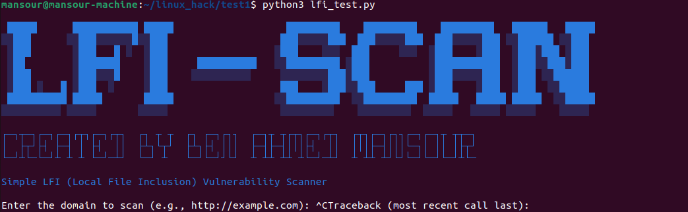

# Local File Inclusion (LFI) Scanner



## Table of Contents
- [Introduction](#introduction)
- [Features](#features)
- [Installation](#installation)
- [Usage](#usage)
- [Configuration](#configuration)
- [Dependencies](#dependencies)
- [Troubleshooting](#troubleshooting)
- [Contributors](#contributors)
- [License](#license)
- [Conclusion](#conclusion)

## Introduction

A Local File Inclusion (LFI) Scanner is a security tool designed to identify vulnerabilities in web applications related to local file inclusion. LFI vulnerabilities occur when a web application allows users to include files from the server’s file system. This can lead to unauthorized access to sensitive files, such as configuration files, password files, and other critical data.

**LFI-SCAN** is a Python-based tool that helps detect LFI vulnerabilities in web applications by scanning a list of predefined paths for potential file inclusion issues. It sends requests to a specified domain with different file paths and analyzes the responses to identify sensitive or potentially harmful content. The tool provides detailed output, highlighting any detected vulnerabilities and offering insights into the nature of the issues.

## Features

- **Path Testing**: Automatically tests a list of file paths for potential LFI vulnerabilities.
- **Sensitive Content Detection**: Scans the content of included files for sensitive information, such as configuration details and password hashes.
- **Progress Tracking**: Displays progress and status updates during the scan.
- **Vulnerability Reporting**: Clearly reports detected vulnerabilities, including the file paths where sensitive content was found.

## Installation

To install the LFI Scanner, follow these steps:

1. Clone the repository:
    ```bash
    git clone https://github.com/yourusername/lfi-scan.git
    ```
2. Navigate to the project directory:
    ```bash
    cd lfi-scan
    ```
3. Install the required dependencies:
    ```bash
    pip install -r requirements.txt
    ```

## Usage

To use the LFI Scanner, follow these steps:

1. **Preparation**: Create a `list.list` file with the paths you want to test. Each line should contain a relative path.
    Example:
    ```plaintext
    ../../etc/passwd
    ../../etc/hosts
    ../../var/log/apache2/access.log
    ```

2. **Execution**: Run the `lfi_scan.py` script and provide the target domain:
    ```bash
    python lfi_scan.py -d targetdomain.com
    ```

## Configuration

- **Target Domain**: Specify the domain you want to scan for LFI vulnerabilities.
- **Path List**: Prepare a `list.list` file with the paths to be tested.

## Dependencies

The LFI Scanner relies on the following Python libraries:
- `requests`
- `argparse`

These dependencies can be installed using the `requirements.txt` file provided in the repository.

## Troubleshooting

If you encounter issues while using the LFI Scanner, consider the following troubleshooting steps:

- Ensure all dependencies are installed correctly.
- Verify that the target domain is reachable.
- Check the format of your `list.list` file for any errors.

## Contributors

- [Mansour Ben Ahmed](https://github.com/mansour188) - Initial work

## License

This project is licensed under the MIT License - see the [LICENSE](LICENSE) file for details.

## Conclusion

The LFI Scanner is a powerful tool for identifying and reporting local file inclusion vulnerabilities in web applications. By automating the process of path testing and sensitive content detection, it helps enhance the security of your web applications.


